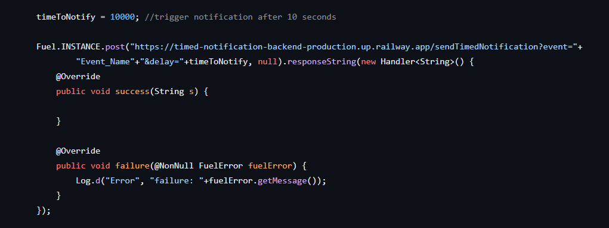

# Android Delayed Notification API using Firebase Cloud Messaging

This API is developed in Node.js to trigger delayed notification. This will allow you to pass Title and Message of notification as body in API request. You can also specify the topic to send notification to a specific group of people.

You have to pass time as millisecond after which you want to trigger the notification.

This API can be used to schedule a reminder of any event like meeting.

### Sample API Call Using Fuel Library

If you want to trigger it at a specific time, you can use the current time for calculating the delayed time.

_i.e., You Want to trigger it at 01:00 pm, on 25th january._

#### delay = Your_Time_In_Milliseconds - Current_Time_In_MilliSeconds
